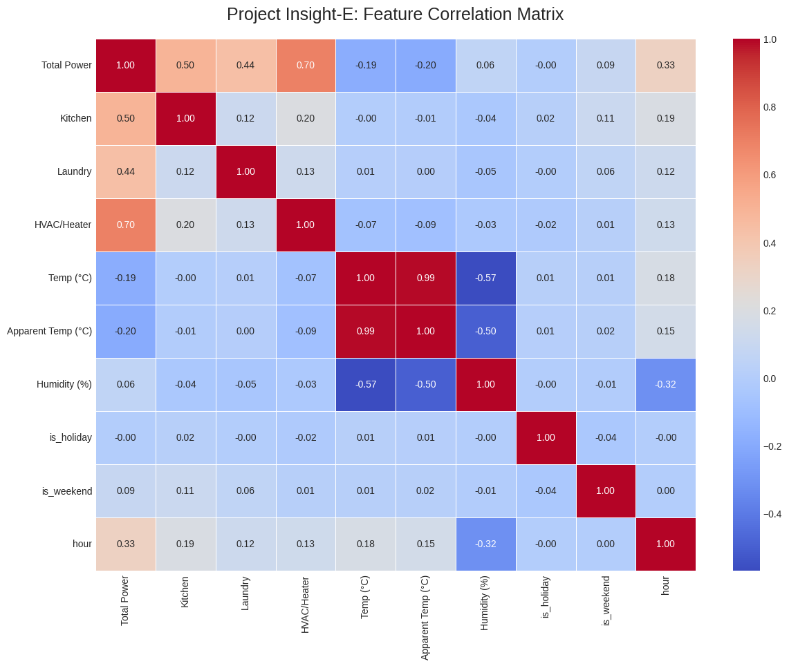

# Project Insight-E: AI-Powered Energy Diagnostics

**Submission for the IEEE PES & YP Challenge by Mouhib Farhat**

---

### 1. Project Vision

**Project Insight-E** is an AI-powered diagnostic tool designed to transform raw energy data into actionable intelligence for households. Instead of just forecasting energy usage, our system learns the unique energy "heartbeat" of a home by integrating appliance-level data with environmental and social contexts. This allows us to move beyond simple prediction and help diagnose the root causes of energy waste, empowering consumers to make smarter, more efficient choices.

### 2. Phase 1: Data Integration & Exploratory Analysis

The foundation of any great AI system is high-quality, contextual data. For Phase 1, our primary goal was to build a rich, multi-source dataset that would serve as the bedrock for our diagnostic model.

#### Our Data Strategy

We programmatically collected and merged three complementary data sources:

1.  **Appliance-Level Energy Data:** The foundational [UCI Household Power Consumption](https://archive.ics.uci.edu/ml/datasets/Individual+household+electric+power+consumption) dataset, providing high-resolution power data and, crucially, sub-metering for the kitchen, laundry, and HVAC systems.
2.  **Environmental Context:** Historical hourly weather data (temperature, humidity, etc.) from the [Open-Meteo API](https://open-meteo.com/), corresponding to the household's location and time period.
3.  **Socio-Economic Context:** Calendar data from the `holidays` library to identify weekends and public holidays, which have distinct consumption rhythms.

#### Exploratory Findings: The Correlation Heatmap

After merging these sources, we performed an exploratory analysis to validate our strategy. The following correlation matrix visualizes the relationships between the key features.



**Key Insights from the Analysis:**

*   **Strong Weather Correlation:** As hypothesized, there is a significant correlation between `Temp (°C)` and `HVAC/Heater` usage, confirming that weather is a primary driver of consumption.
*   **Behavioral Patterns:** The `hour` of the day shows strong correlations with nearly all sub-meters, proving the existence of daily routines that our model will be able to learn.
*   **Sub-metering Value:** The different sub-meters (e.g., `Kitchen`, `Laundry`) show distinct correlation patterns, highlighting their importance for providing specific, actionable diagnostic feedback.

This successful analysis confirms that our integrated dataset is rich with predictive signals, setting a strong foundation for the modeling phase.

### 3. Technology Stack

*   **Language:** Python 3
*   **Core Libraries:** Pandas (Data Manipulation), Matplotlib & Seaborn (Visualization)
*   **Data Sourcing:** Requests (API Communication), `holidays` (Calendar Data)

### 4. How to Reproduce This Analysis

1.  **Clone the repository:**
    ```bash
    git clone [your-repo-url]
    cd [your-repo-folder]
    ```

2.  **Install dependencies:**
    ```bash
    pip install pandas requests matplotlib seaborn holidays
    ```

3.  **Run the data pipeline:**
    ```bash
    python insight-e_data_pipeline.py
    ```
    The script will download the necessary data, perform the analysis, and regenerate the `insight-e_correlation_heatmap.png` file.

### 5. The Road Ahead: Phase 2 Plan

With a robust dataset now established, our plan for Phase 2 is to:

1.  **Develop the Diagnostic Model:** Implement a Long Short-Term Memory (LSTM) network, which is well-suited for multivariate time-series forecasting.
2.  **Implement Explainability:** Integrate SHAP (SHapley Additive exPlanations) to interpret the model's predictions. This will allow us to move from anomaly detection to anomaly *diagnosis* by identifying which features are causing a deviation from the norm.
3.  **Build a Proof-of-Concept:** Create a simple interface to showcase the system's ability to forecast usage and provide diagnostic insights.
